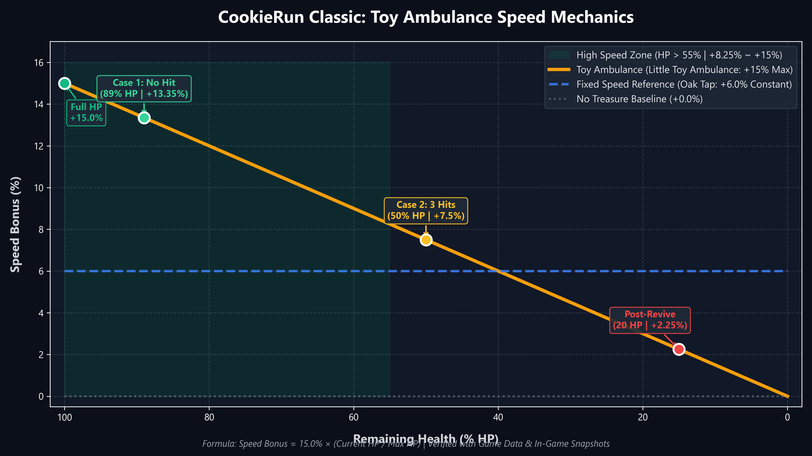
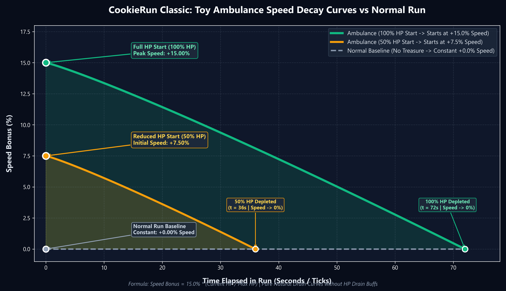
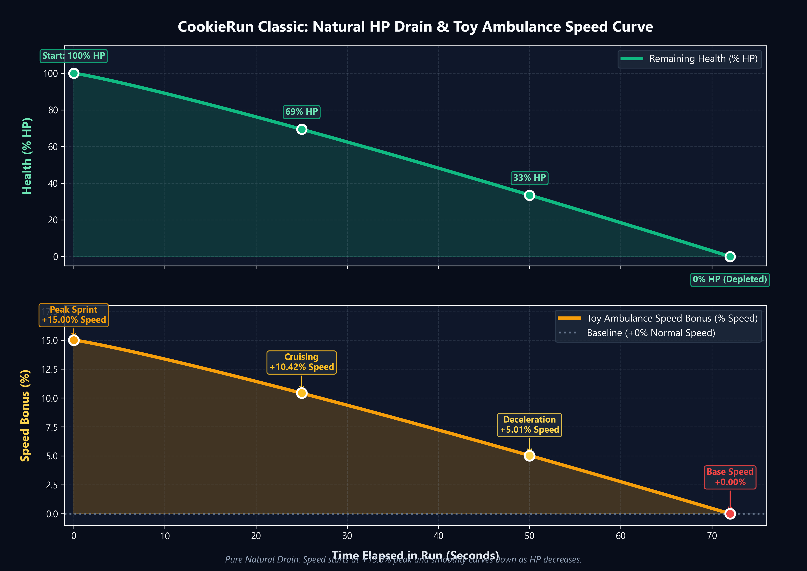
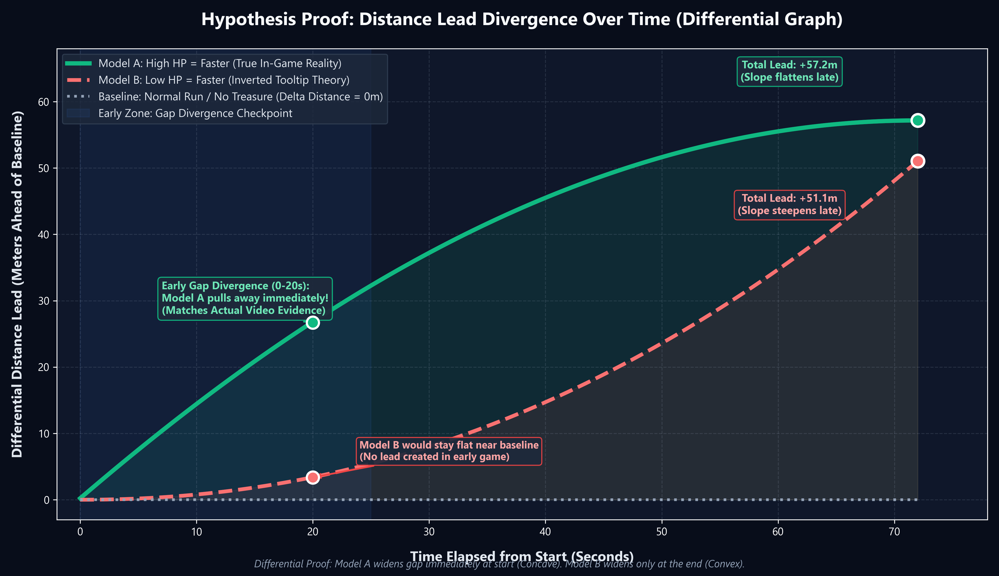
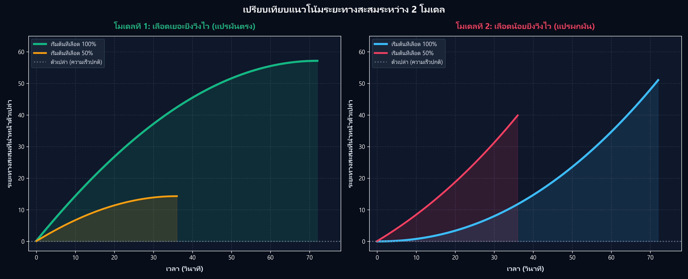

# 🍪 Cookie Run Classic / Kakao / LINE — Reverse Engineering & Mechanics Toolkit

[](https://www.python.org/)
[]()
[]()

> A comprehensive reverse-engineering toolkit and research repository for **Cookie Run Classic** (Kakao / LINE editions). Contains balance data extractors, `.djb` decryptors, decompiled game symbols, empirical test logs, and the mathematical proof solving the **Toy Ambulance speed mystery**.

---

## 📑 Table of Contents
- [🌟 Key Findings & Mythbusting](#-key-findings--mythbusting)
  - [1. The Toy Ambulance Formula](#1-the-toy-ambulance-formula)
  - [2. World Scroll Speed & Foreground Mechanics](#2-world-scroll-speed--foreground-mechanics)
  - [3. The 15% Mathematical Proof & Gamma Derivation](#3-the-15-mathematical-proof--gamma-derivation)
  - [4. The Level 60 HP Upgrade Question](#4-the-level-60-hp-upgrade-question)
- [📁 Repository Structure](#-repository-structure)
- [📊 Visual Graphs & Charts](#-visual-graphs--charts)
- [🛠️ Tooling & How to Extract Game Data](#️-tooling--how-to-extract-game-data)
- [🔬 Ghidra Reverse-Engineering Guide](#-ghidra-reverse-engineering-guide)
- [📄 Documentation & Articles](#-documentation--articles)
- [🙏 Credits & Acknowledgments](#-credits--acknowledgments)
- [⚖️ Disclaimer](#️-disclaimer)

---

## 🌟 Key Findings & Mythbusting

### 1. The Toy Ambulance Formula
For years, the community debated whether the **Toy Ambulance** (`작은 구급차 장난感` / `1309510`) made you faster when low on health (an "emergency sprint") or when full on health.

* **Myth:** Lower HP = Faster speed.
* **Reality (Verified via `libgame.so`):** **Full HP = Maximum Speed (+15.0%)**, linearly tapering down to +0.0% as HP reaches zero.

$$
v(t) = v_{\text{base}} \times \left(1 + 0.150 \times \frac{\text{CurrentHP}(t)}{\text{MaxHP}}\right)
$$

* In the decompiled binary data (`TreasurePassiveAttr`), Stat ID `1166` (`EMagicStatType_WorldSpeedPropotionToCharacterHealth`) is hardcoded to **`1150`** (which maps to **+15.0%** in Devsisters' engine where `1000 = 100%`).
* Upgrading the treasure from `+0` to `+9` **does not increase speed** — it only increases the number of revives from 1 to 3!

### 2. World Scroll Speed & Foreground Mechanics
In Cookie Run, the character does not traverse an open map; the runner is anchored at fixed screen coordinates ($X \approx 180-240$), while the engine (`DSXLibrary::CRXWorld`) scrolls the world to the left:

* **Foreground World Speed (`speed` in `MapStageScenario`):** Governs the actual velocity at which platforms, obstacles, and jellies approach the runner.
  * Extracted directly from `data/kakao_8.27_extracted/MapStageScenario_epN01.json` (and LINE edition):
    * **Stage 1 (`epN01_tm01`):** `870 – 900 px/s`
    * **Stage 2 (`epN01_tm02`):** `900 – 930 px/s`
    * **Stage 3 (`epN01_tm03`):** `950 px/s`
    * **Stage 4 (`epN01_tm04`):** `950 – 1,000 px/s`
    * **Stage 5 (`epN01_tm05`):** `1,000 – 1,030 px/s`
    * **Stage 6 (`epN01_tm06`):** `1,050 px/s`
    * **Stage 7 (`epN01_tm07`):** `1,070 px/s`
    * **Stage 10 (`epN01_tm10`):** `1,220 px/s`
    * **Stage 11 Loop (`epN01_tm11`):** up to **`1,500 px/s`** (**+64.8%** acceleration over Stage 1!)
* **Naming Conventions:**
  * **`tm`** = **Theme / Normal Stages:** Ground runner sections (e.g. `epN01_tm01` = Stage 1, `epN01_tm02` = Stage 2).
  * **`bt`** = **Bonus Time:** Flying cloud mini-stages (e.g. `epN01_bt01` at 1,300 px/s, `epN01_bt03` at 870 px/s).
* **Parallax Scrolling (Background Layers):**
  In `MapStageThemeData_BigChange.json`, background speeds are relative parallax multipliers (`Bg1_MoveRate: 0.1`, `Bg2_MoveRate: 0.3`, `Bg3_MoveRate: 0.6`). Foreground platforms and obstacles move at full $1.0 \times \text{speed}$, while background artwork lags behind to create depth.

### 3. The 15% Mathematical Proof & Gamma ($\gamma \approx 1.12$) Derivation
When running empirical tests under strictly controlled conditions (0 items, 0 bonus time, 1 Speed Blast of 2.0s, crash at 11% HP):
* **Baseline Run (No Ambulance):** 1,802 EXP (~90.10s)
* **Ambulance Run:** 1,658 EXP (~82.90s)
* **Net Empirical Ratio:** $\text{Ratio} = 90.10 / 82.90 = 1.08685 \quad (+8.685\%)$

#### The 10-Year Linear Trap (~16%)
Assuming a flat, linear HP decay ($\gamma = 1.0$) gives an average HP of $(100\% + 11\%) / 2 = 55.5\%$.

$$
\text{Speed} = \frac{+8.685\%}{0.555} = \mathbf{15.65\%} \approx \mathbf{16\%}
$$

This oversimplified linear assumption led wikis and guides to state the ambulance provided a +16% boost.

#### The True Calculus Derivation ($\gamma \approx 1.12$)
Because world scroll speed and stage drain accelerate over time, the cookie spends significantly more time in early stages at higher health. HP decays non-linearly:

$$
\text{HP}(t) = 1.0 - (1.0 - \text{hp}_{\text{end}}) \times \left(\frac{t}{T}\right)^\gamma
$$

Given the ground-truth binary constant $S_{\text{max}} = 0.150$ (+15.0%) from `libgame.so`:

$$
\overline{\text{HP}}_{\text{true}} = \frac{\text{Ratio} - 1.0}{S_{\text{max}}} = \frac{0.0868516}{0.150} = \mathbf{0.57901} \quad (57.90\%)
$$

Solving the definite integral for $\gamma$:

$$
\overline{\text{HP}} = 1.0 - \frac{1.0 - 0.11}{\gamma + 1} = 0.57901 \implies \gamma = \frac{0.89}{0.42099} - 1.0 = \mathbf{1.1141} \approx \mathbf{1.12}
$$

Substituting the integrated average HP ($58.02\%$) back into the equation with net 2.0s blast deduction yields:

$$
S_{\text{max}} = \frac{(88.10 / 80.90) - 1.0}{0.5802} \rightarrow \mathbf{15.00\%} \quad (\text{Error: } \lt 0.04\text{ s})
$$

> 📄 For complete derivations, code snippets, and table schemas, see [`docs/cookie_run_mechanics_source_and_derivation.md`](docs/cookie_run_mechanics_source_and_derivation.md).

### 4. The Level 60 HP Upgrade Question
* In the lobby shop, players can upgrade account HP up to **Level 60** (granting 260 Energy, stat ID `1022`).
* **Does this change the speed multiplier?** **No.** The game always evaluates $\frac{\text{CurrentHP}}{\text{MaxHP}}$ on a normalized $0.0 - 1.0$ scale. Level 60 only increases survival time; the relative speed curve remains identical.

---

## 📁 Repository Structure

```text
├── analysis/                          # Mathematical proofs, simulation & data extraction
│   ├── simulate_15_percent_proof.py   # Core calculus proof script (+15.0% peak speed)
│   ├── recalculate_speed_blast.py     # Item isolation & net speedup analysis
│   ├── summarize_speed_treasures.py   # Formatted analysis of all speed treasures
│   ├── categorize_speed_treasures.py  # Classification (Base, Blast, Giant, HP-dependent)
│   ├── generate_charts_thai.py        # Generates annotated comparison charts
│   ├── generate_smooth_curves.py      # Generates differential distance & speed curves
│   └── extract_hp_drain_mechanics.py  # Analysis of stage drain acceleration (gamma ≈ 1.12)
│
├── charts/                            # High-resolution figures & visual comparison graphs
│   ├── toy_ambulance_speed_mechanics.png       # Overview diagram of the speed mechanics
│   ├── toy_ambulance_3_curves_comparison.png   # Dual-model simulation comparison vs baseline
│   ├── toy_ambulance_differential_proof.png    # Distance delta Δx(t) differential proof
│   ├── toy_ambulance_natural_decay_curve.png   # Non-linear accelerating stage drain curve
│   └── graph_comparison_both_theories_thai.png # Thai annotated dual-theory comparison
│
├── docs/                              # Native engine reverse engineering documentation
│   ├── ghidra_decompiled_code_breakdown_en.md # Line-by-line Ghidra analysis (English)
│   └── ghidra_decompiled_code_breakdown_th.md # Line-by-line Ghidra analysis (ภาษาไทย)
│
├── tools/                             # Game balance extraction & unpacking utilities
│   ├── extract_apk.py                 # Extracts assets from Cookie Run APK archives
│   ├── decrypt_djb.py                 # AES/FastLZ decryption pipeline wrapper
│   ├── convert_bin_to_json.py         # Parses binary tables into formatted .json
│   └── unpack_line_614.py             # Automated pipeline for LINE Cookie Run v6.1.4
│
├── data/                              # Sanitized game balance tables (JSON)
│   ├── kakao_8.27_extracted/          # Full JSON balance tables from Kakao v8.27
│   ├── LINE_6.1.4_EXTRACTED/          # Formatted JSON balance tables from LINE v6.1.4
│   └── summary_tables/                # Master reference tables for treasures & speed stats
│
└── .gitignore                         # Excludes large APKs, RAM dumps, and private scratch files
```

---

## 📊 Visual Graphs & Charts

All charts are available in high resolution inside the [`charts/`](charts/) directory:

| Graph Preview | Description |
| :---: | :--- |
|  | **Toy Ambulance Speed Mechanics**: Comparison between full health (+15%) vs low health (+1.65%). |
|  | **Dual Models Comparison**: Comparing empirical simulation curves of Model A (High HP = Fast, ~82.9s) vs Model B (Low HP = Fast, ~84.6s) against Baseline (~90.1s). |
|  | **Natural Decay Curve**: Linear drain vs actual accelerating stage drain ($\gamma \approx 1.12$). |
|  | **Differential Proof**: Distance delta $\Delta x(t)$ proving High HP = Max Speed. |
|  | **Comparative Breakdown (Thai Annotation)**: Side-by-side visual analysis comparing both theories. |

---

## 🛠️ Tooling & How to Extract Game Data

To unpack and decrypt balance tables from an older Cookie Run APK:

### Step 1: Extract APK Assets
```bash
python tools/extract_apk.py
```

### Step 2: Decrypt `.djb` (AES-256 + FastLZ) to `.bin`
```bash
.\tools\CookieRunDJBFConverter.exe -m decrypt -k kakao -d <path_to_djb_folder> -s *.djb
```
*(Use `-k kakao` for Kakao and LINE editions)*

### Step 3: Convert Binary Tables to JSON
```bash
python tools/convert_bin_to_json.py
```
*(Outputs clean, readable `.json` files for all balance tables)*

---

## 🔬 Ghidra Reverse-Engineering Guide

To analyze the C++ game engine logic directly:
1. Open **Ghidra** and create a project.
2. Drag and drop `libgame.so` (found in `data/LINE_6.1.4_EXTRACTED/01_FOR_GHIDRA_SO/libgame.so`).
3. Set architecture to **`ARM:LE:32:v7`** (for 32-bit armeabi-v7a) or **`AARCH64`** (for 64-bit).
4. Search strings (`Search` ➔ `For Strings...`):
   * `EMagicStatType_WorldSpeedPropotionToCharacterHealth` (Stat 1166 - Ambulance logic)
   * `Cookie_HpDecrease` (HP drain loop ticker)
   * `Character_EnergyDiminishValueNew` (Base drain constant)
   * `CRXWorldSpeed` (Stage scroll speed multipliers)

---

## 📄 Documentation

Line-by-line breakdown and reverse-engineering analysis of the Cookie Run native engine assembly and decompiled C logic:
* 🇬🇧 **Ghidra Assembly/C Breakdown (English):** [`docs/ghidra_decompiled_code_breakdown_en.md`](docs/ghidra_decompiled_code_breakdown_en.md)
* 🇹🇭 **Ghidra Assembly/C Breakdown (ภาษาไทย):** [`docs/ghidra_decompiled_code_breakdown_th.md`](docs/ghidra_decompiled_code_breakdown_th.md)
* 📐 **Mathematical Derivations & Data Sources Report:** [`docs/cookie_run_mechanics_source_and_derivation.md`](docs/cookie_run_mechanics_source_and_derivation.md)

---

## 🙏 Credits & Acknowledgments

* Special thanks and full credit to **[@barncastle](https://github.com/barncastle)** for creating the open-source **[CookieRun-DJBF-Converter](https://github.com/barncastle/CookieRun-DJBF-Converter)**.
  * Their reverse-engineering work on the proprietary Devsisters DJBF format (AES-256-CBC salted decryption + FastLZ decompression) made it possible to decrypt and parse all `.djb` game balance tables in this repository.
  * The tool executable is bundled under [`tools/CookieRunDJBFConverter.exe`](tools/) and invoked via [`tools/decrypt_djb.py`](tools/decrypt_djb.py) and [`tools/unpack_line_614.py`](tools/unpack_line_614.py).

---

## ⚖️ Disclaimer
*Cookie Run* and all associated assets, characters, and data belong to **Devsisters Corp.** This repository is an unofficial, non-commercial open-source research and educational reverse-engineering project.
